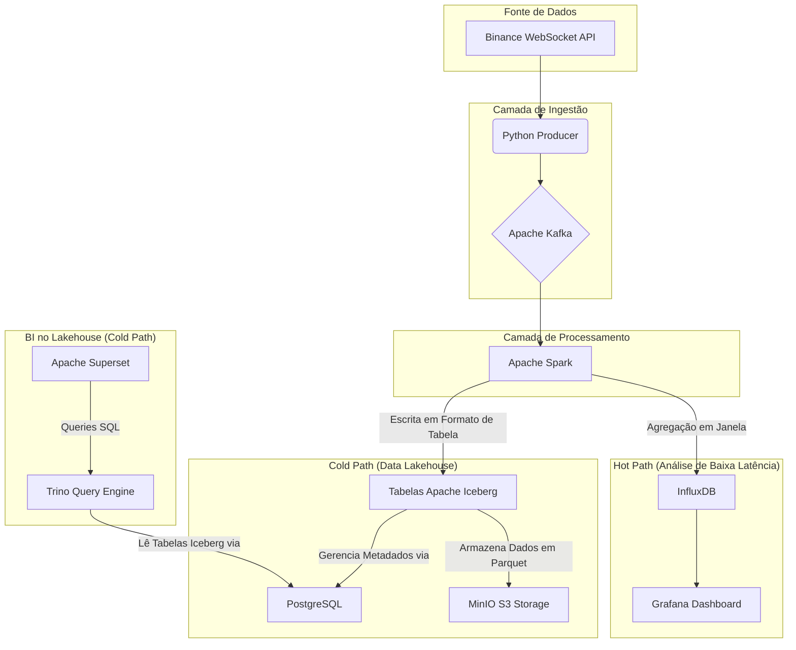

# Crypto Data Pipeline em Tempo Real com Arquitetura Híbrida

Este projeto implementa um pipeline de dados completo e robusto para capturar, processar, armazenar e visualizar dados de trades de criptomoedas (BTC/USDT) em tempo real. A infraestrutura é totalmente orquestrada com **Docker Compose**, criando um ambiente de desenvolvimento e análise completo e facilmente replicável.


## 🏛️ Arquitetura Híbrida (Hot & Cold Path)

O projeto utiliza uma arquitetura Lambda simplificada, com um caminho "quente" para análise de baixa latência e um caminho "frio" para armazenamento de longo prazo e análises complexas.



* **Fluxo Comum:** Um **Producer** em Python captura dados da Binance e os publica no **Kafka**. O **Spark** consome esses dados em tempo real.
* **Hot Path:** Uma query de streaming no Spark realiza agregações em janela e salva os resultados no **InfluxDB**, que são exibidos em um dashboard no **Grafana** para monitoramento instantâneo.
* **Cold Path:** Outra query de streaming no Spark pega os dados, os estrutura e os salva em tabelas no formato **Apache Iceberg**, com os arquivos físicos (Parquet) armazenados no **MinIO**. O catálogo de metadados do Iceberg é gerenciado pelo **PostgreSQL**. Ferramentas de BI como o **Superset** podem então usar o **Trino** para fazer consultas SQL de alta performance diretamente no Lakehouse.


## Visão Geral da Arquitetura

O fluxo de dados segue as seguintes etapas:

* **Coleta (`Producer`):** Um serviço em Python se conecta via WebSocket à API da Binance para capturar cada novo trade de BTC/USDT.
* **Ingestão e Fila (`Kafka`):** O Producer publica os dados brutos em um tópico no cluster Kafka, que atua como um buffer resiliente e de alta performance.
* **Processamento (`Spark`):** Um cluster Spark Standalone (Master + Worker) consome os dados do Kafka em modo streaming, realiza agregações em janelas de tempo (ex: volume e preço médio a cada 10s) e enriquece os dados.
* **Armazenamento curto prazo (`InfluxDB`):** O job do Spark salva os dados agregados em um bucket no InfluxDB, um banco de dados otimizado para séries temporais.
* **Armazenamento longo prazo (`MinIO`):** O job Spark salva os dados agregados em um bucket no MinIO, um datalake voltado para bigdata e armazenamento de longo prazo. 
* **Motor de Consulta (`Trino`):** Trino é o nosso Query Engine, responsável por ler dados massivos de forma rápida.
* **Metastore (`Iceberg`):** Ferramenta responsável por adicionar a camada de gerenciamento de metadados no nosso datalake e assim transformando-o em lakehouse.
* **Visualização Streaming (`Grafana`):** Um dashboard no Grafana se conecta ao InfluxDB para exibir os dados em gráficos que se atualizam em tempo real.
* **Visualização (`Superset`):** Ferramenta de visualização, na qual conectamos direto no Trino. 

## Tecnologias Utilizadas

* **Orquestração:** Docker, Docker Compose
* **Mensageria:** Apache Kafka, Zookeeper
* **Processamento de Stream:** Apache Spark (PySpark), Spark Structured Streaming
* **Armazenamento (Data Lakehouse):**
    * **Object Storage:** MinIO
    * **Tabela (Formato):** Apache Iceberg
    * **Metastore (Catálogo):** PostgreSQL
* **Armazenamento (Hot Path):** InfluxDB v2
* **Motor de Consulta (Query Engine):** Trino
* **Visualização (BI):** Grafana, Apache Superset

## Estrutura do Projeto

A organização dos arquivos segue um padrão de monorepo, separando o código da aplicação (`src`), as configurações de infraestrutura (`infra`) e os dados persistidos (`data`).

``` bash
/crypto-data-pipeline/
│
├── .env                  # Arquivo local (IGNORADO PELO GIT) com seus segredos
├── .gitignore            # Arquivos e pastas a serem ignorados pelo Git
├── docker-compose.yml    # O coração do projeto, orquestra todos os serviços
├── README.md             # Esta documentação
│
├── data/                 # Dados persistidos pelos serviços (IGNORADO PELO GIT)
│   ├── grafana/
│   ├── influxdb/
│   ├── jupyter-notebook/ # <-- Dados persistentes do jupyter notebook
│   ├── kafka/            # <-- Dados persistentes do Kafka
│   ├── minio/            # <-- Dados persistentes do MinIO (buckets, objetos)
│   ├── postgres/         # <-- Dados persistentes do Postgres
│   ├── superset/         # <-- Dados persistentes do Superset (dashboards, config)
│   └── zookeeper/        # <-- Dados persistentes do Zookeeper
│
├── infra/                # Arquivos de configuração versionados
│   ├── kafka/
│   │   └── config.txt    # Exemplo de config para um cliente Kafka
│   ├── superset/
│   │   └── superset_config.py # Configuração customizada do Superset
│   └── trino/
│       └── catalog/
│           └── iceberg.properties # Definição do catálogo Iceberg para o Trino
│
└── src/                  # Nosso código customizado
    ├── producer/
    │   ├── app/
    │   ├── Dockerfile
    │   └── requirements.txt
    │
    ├── spark-processor/
    │   ├── app/              # Lógica de streaming do Spark (Hot e Cold paths)
    │   │   ├── main.py
    │   │   │
    │   │   ├── config/
    │   │   │   └── settings.py
    │   │   │
    │   │   ├── schema/
    │   │   │   └── schema.py
    │   │   │
    │   │   ├── sources/
    │   │   │   └── kafka.py
    │   │   │
    │   │   ├── transform/
    │   │   │   └── transformations.py
    │   │   │
    │   │   ├── sink/
    │   │   │   ├── iceberg.py
    │   │   │   └── influxdb.py
    │   │   │
    │   │   └── utils/
    │   │       └── logging_config.py
    │   ├── Dockerfile
    │   ├── requirements.txt
    |   └── app.zip 
    │
    └── superset/
        └── Dockerfile          # Dockerfile customizado para o Superset (instala drivers)
```

## Como Executar (Setup e Inicialização)

Siga os passos abaixo para iniciar o pipeline completo.

**Pré-requisitos:**

* Docker e Docker Compose instalados.
* Git instalado.
* Acesso de terminal à sua VM Linux onde o Docker está rodando.

## Passos

### Passo 1: Configurar Variáveis de Ambiente

Crie seu arquivo de ambiente local. (Este projeto não usa um `.env.example`, então crie-o manualmente).

1.  Crie o arquivo:
    ```bash
    nano .env
    ```
2.  Cole **todas** as variáveis que os serviços do `docker-compose.yaml` esperam. Gere uma `SUPERSET_SECRET_KEY` segura (ex: `openssl rand -base64 42`).

    ```bash
    # Credenciais do Postgres
    POSTGRES_USER=seu_usuario_aqui
    POSTGRES_PASSWORD=sua_senha_forte_aqui
    POSTGRES_DB=iceberg_meta # Ou o nome do seu banco de dados para o Iceberg
    
    # Credenciais do MinIO
    MINIO_USER=seu_usuario_minio
    MINIO_PASSWORD=sua_senha_minio
    
    # Token do InfluxDB
    INFLUXDB_TOKEN=seu_token_gerado_na_ui_do_influx
    
    # Chave Secreta do Superset
    SUPERSET_SECRET_KEY=sua_chave_segura_gerada_com_openssl
    
    # (Adicione outras variáveis como INFLUXDB_USER, ORG, BUCKET, etc., conforme seu .env)
    ```

### Passo 2: Criar Arquivos de Configuração da Infra

O Trino e o Superset precisam de arquivos de configuração locais para iniciar.

1.  **Crie o arquivo do Trino:**
    ```bash
    mkdir -p ./infra/trino/catalog
    nano ./infra/trino/catalog/iceberg.properties
    ```
    Cole o conteúdo abaixo, **substituindo os valores** (`SEU_USUARIO_POSTGRES`, etc.) pelas credenciais **exatas** que você definiu no `.env` (o Trino não lê variáveis de ambiente deste arquivo).

    ```bash
    # infra/trino/catalog/iceberg.properties
    connector.name=iceberg
    iceberg.catalog.type=jdbc
    iceberg.file-format=parquet
    iceberg.jdbc-catalog.driver-class=org.postgresql.Driver
    
    # --- FAÇA O HARDCODE DAS SUAS CREDENCIAIS AQUI ---
    iceberg.jdbc-catalog.connection-url=jdbc:postgresql://postgres:5432/SEU_BD_POSTGRES
    iceberg.jdbc-catalog.connection-user=SEU_USUARIO_POSTGRES
    iceberg.jdbc-catalog.connection-password=SUA_SENHA_POSTGRES
    # --------------------------------------------------
    
    iceberg.jdbc-catalog.default-warehouse-dir=s3a://cripto-data/
    iceberg.jdbc-catalog.catalog-name=cripto_data # Deve ser igual ao catalog_name do Spark
    
    fs.native-s3.enabled=true
    s3.endpoint=http://minio:9000
    s3.region=us-east-1
    s3.path-style-access=true
    
    # --- FAÇA O HARDCODE DAS SUAS CREDENCIAIS AQUI ---
    s3.aws-access-key=SEU_USUARIO_MINIO
    s3.aws-secret-key=SUA_SENHA_MINIO
    # --------------------------------------------------
    ```

2.  **Crie o arquivo do Superset:**
    ```bash
    mkdir -p ./infra/superset
    nano ./infra/superset/superset_config.py
    ```
    Cole este conteúdo. Este arquivo *lê* as variáveis de ambiente, então **não** é preciso fazer hardcode.

    ```python
    # infra/superset/superset_config.py
    import os
    
    # Lê a chave secreta do .env
    SECRET_KEY = os.environ.get("SUPERSET_SECRET_KEY")
    
    # Constrói a URI do banco de metadados a partir das variáveis do .env
    POSTGRES_USER = os.environ.get("POSTGRES_USER")
    POSTGRES_PASSWORD = os.environ.get("POSTGRES_PASSWORD")
    POSTGRES_HOST = "postgres"
    POSTGRES_DB = "superset_meta" # Banco de dados que criaremos manualmente
    
    SQLALCHEMY_DATABASE_URI = (
        f"postgresql+psycopg2://{POSTGRES_USER}:{POSTGRES_PASSWORD}@"
        f"{POSTGRES_HOST}:5432/{POSTGRES_DB}"
    )
    
    FEATURE_FLAGS = {
        "ENABLE_TEMPLATE_PROCESSING": True,
    }
    ```

### Passo 3: Corrigir Permissões de Volume (Passo Manual Crítico)

As imagens do Kafka e Zookeeper rodam com um usuário não-root (UID `1000`). Para permitir que elas escrevam nos volumes persistentes, você precisa alterar a propriedade das pastas no seu host.

```bash
# Crie os diretórios de dados se eles não existirem
mkdir -p ./data/kafka/data
mkdir -p ./data/zookeeper/data

# Mude a propriedade para o UID 1000 (usuário 'appuser' do container) ou coloque seu usuário
# (Assumindo que seu usuário host principal também é o UID 1000)
sudo chown -R 1000:1000 ./data/kafka/data
sudo chown -R 1000:1000 ./data/zookeeper/data

# Dê permissão de execução
sudo chmod +x ./src/producer/app/wait-for-it.sh
```

### Passo 4: Subir a Stack

Este comando irá construir as imagens customizadas (Spark, Producer, Superset) e iniciar todos os 11 serviços.

```bash
docker compose up --build -d
```
O `--build` é necessário na primeira vez para construir a imagem do Superset com os drivers corretos.

### Passo 5: Inicialização Manual dos Bancos (Passo Manual Crítico)

Os serviços estão rodando, mas precisam ser "preparados".

1.  **Crie os Bancos de Dados no Postgres:**
    Acesse o container `postgres` e crie os bancos de dados para o Iceberg e o Superset.

    ```bash
    # Crie o banco para o Iceberg (use o nome que você colocou no .env e no iceberg.properties)
    docker compose exec postgres psql -U ${POSTGRES_USER} -d postgres -c "CREATE DATABASE ${POSTGRES_DB};"
    
    # Crie o banco para o Superset
    docker compose exec postgres psql -U ${POSTGRES_USER} -d postgres -c "CREATE DATABASE superset_meta;"
    ```

2.  **Inicialize o Superset:**
    Execute estes três comandos **em ordem** para configurar o banco de dados do Superset, criar o admin e definir as permissões.

    ```bash
    # 1. Cria o esquema de tabelas do Superset no banco 'superset_meta'
    docker compose exec superset superset db upgrade
    
    # 2. Cria o usuário administrador
    docker compose exec superset superset fab create-admin --username admin --password admin --firstname Superset --lastname Admin --email admin@superset.com
    
    # 3. Inicializa os papéis e permissões padrões
    docker compose exec superset superset init
    ```

### Passo 6: Acessar as Interfaces (UIs)

* **Kafka UI:** `http://<IP_DA_SUA_VM>:8090` (Veja o tópico `binance-trades-raw`)
* **MinIO (S3):** `http://<IP_DA_SUA_VM>:9001` (Login com `MINIO_USER`/`MINIO_PASSWORD`. Veja o bucket `cripto-data`)
* **Trino:** `http://<IP_DA_SUA_VM>:8070` (Veja o catálogo `iceberg`)
* **Superset:** `http://<IP_DA_SUA_VM>:8050` (Login com `admin`/`admin`. Conecte ao Trino!)
* **Grafana:** `http://<IP_DA_SUA_VM>:3000` (Login `admin`/`admin`)
* **InfluxDB:** `http://<IP_DA_SUA_VM>:8086` (Configure seu token)
* **Spark Master:** `http://<IP_DA_SUA_VM>:8088` (Veja o `spark-processor` rodando)
* **Spark Job:** `http://<IP_DA_SUA_VM>:4040` (Veja os detalhes do job de streaming)
