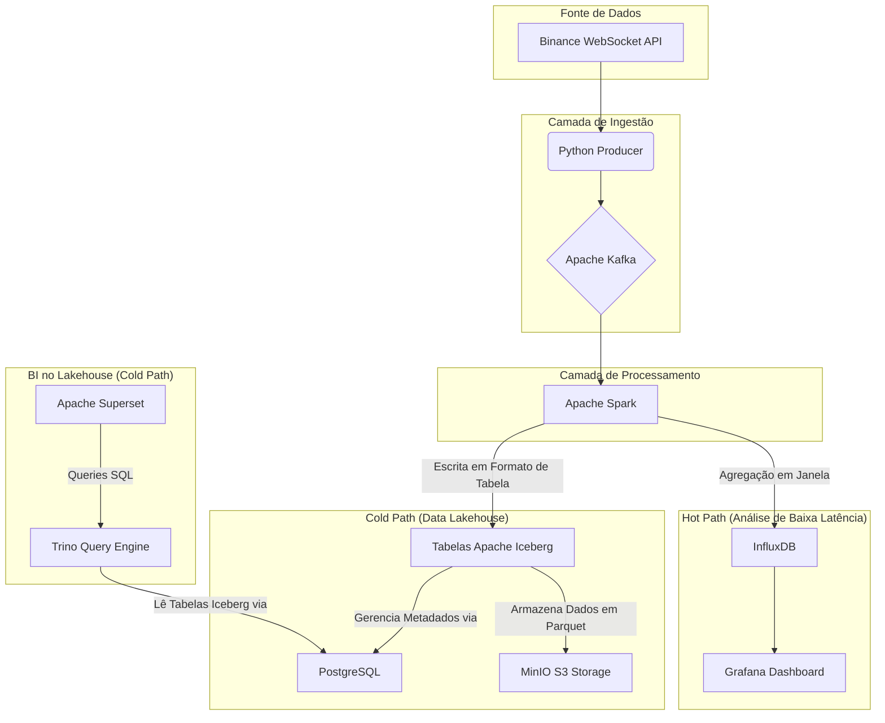

````markdown
# Crypto Data Pipeline em Tempo Real com Arquitetura Híbrida

Este projeto implementa um pipeline de dados completo e robusto para capturar, processar, armazenar e visualizar dados de trades de criptomoedas (BTC/USDT) em tempo real. A infraestrutura é totalmente orquestrada com **Docker Compose**, criando um ambiente de desenvolvimento e análise completo e facilmente replicável.


## 🏛️ Arquitetura Híbrida (Hot & Cold Path)

O projeto utiliza uma arquitetura Lambda simplificada, com um caminho "quente" para análise de baixa latência e um caminho "frio" para armazenamento de longo prazo e análises complexas.



* **Fluxo Comum:** Um **Producer** em Python captura dados da Binance e os publica no **Kafka**. O **Spark** consome esses dados em tempo real.
* **Hot Path:** Uma query de streaming no Spark realiza agregações em janela e salva os resultados no **InfluxDB**, que são exibidos em um dashboard no **Grafana** para monitoramento instantâneo.
* **Cold Path:** Outra query de streaming no Spark pega os dados, os estrutura e os salva em tabelas no formato **Apache Iceberg**, com os arquivos físicos (Parquet) armazenados no **MinIO**. O catálogo de metadados do Iceberg é gerenciado pelo **PostgreSQL**. Ferramentas de BI como o **Superset** podem então usar o **Trino** para fazer consultas SQL de alta performance diretamente no Lakehouse.


## Visão Geral da Arquitetura (Atualizar daqui para baixo)

O fluxo de dados segue as seguintes etapas:

* **1. Coleta (`Producer`):** Um serviço em Python se conecta via WebSocket à API da Binance para capturar cada novo trade de BTC/USDT.
* **2. Ingestão e Fila (`Kafka`):** O Producer publica os dados brutos em um tópico no cluster Kafka, que atua como um buffer resiliente e de alta performance.
* **3. Processamento (`Spark`):** Um cluster Spark Standalone (Master + Worker) consome os dados do Kafka em modo streaming, realiza agregações em janelas de tempo (ex: volume e preço médio a cada 10s) e enriquece os dados.
* **4. Armazenamento (`InfluxDB`):** O job do Spark salva os dados agregados em um bucket no InfluxDB, um banco de dados otimizado para séries temporais.
* **5. Visualização (`Grafana`):** Um dashboard no Grafana se conecta ao InfluxDB para exibir os dados em gráficos que se atualizam em tempo real.

## Tecnologias Utilizadas

* **Orquestração:** Docker, Docker Compose
* **Mensageria:** Apache Kafka, Zookeeper
* **Processamento de Dados:** Apache Spark (PySpark), Spark Structured Streaming
* **Coleta de Dados:** Python, `binance-futures-connector-python`
* **Banco de Dados:** InfluxDB v2
* **Visualização:** Grafana

## Estrutura do Projeto

A organização dos arquivos segue um padrão de monorepo, separando o código da aplicação (`src`), as configurações de infraestrutura (`infra`) e os dados persistidos (`data`).

```bash
/crypto-data-pipeline/
│
├── .env                    # Arquivo local (IGNORADO PELO GIT) com seus segredos
├── .gitignore              # Arquivos e pastas a serem ignorados pelo Git
├── CONTRIBUTING.md         # Diretrizes de contribuição e padrões de commit
├── docker-compose.yml      # O coração do projeto, orquestra todos os serviços
├── README.md               # Esta documentação
│
├── .github/                # Arquivos de template para o GitHub
│   └── PULL_REQUEST_TEMPLATE.md
│
├── data/                   # Dados persistidos pelos serviços (IGNORADO PELO GIT)
│   ├── grafana/
│   └── influxdb/
│
├── infra/                  # Arquivos de configuração versionados
│   └── kafka/
│       └── config.txt # Exemplo de config para um cliente Kafka
│
└── src/                    # Nosso código customizado
    ├── producer/
    │   ├── app/
    │   │   ├── main.py
    │   │   └── wait-for-it.sh # Script de espera para o Kafka
    │   ├── Dockerfile
    │   └── requirements.txt
    │
    └── spark-processor/
        ├── app/
        │   └── processor.py
        ├── Dockerfile
        └── requirements.txt
````

## Como Executar (Setup e Inicialização)

Siga os passos abaixo para iniciar o pipeline completo.

**Pré-requisitos:**

  * Docker e Docker Compose instalados.
  * Git instalado.
  * Acesso de terminal à sua VM Linux onde o Docker está rodando.

**Passos:**

1.  **Clonar o Repositório:**

    ```bash
    git clone [https://github.com/BrenoLD94/crypto-data-pipeline.git](https://github.com/BrenoLD94/crypto-data-pipeline.git)
    cd crypto-data-pipeline
    ```

2.  **Configurar Variáveis de Ambiente:**
    Crie seu arquivo de ambiente local a partir do template.

    ```bash
    cp .env.example .env
    ```

    Agora, **edite o arquivo `.env`** e preencha com seus próprios valores, principalmente o `INFLUXDB_TOKEN` que você gerou na UI do InfluxDB.

3.  **Dar Permissão de Execução:**
    O Git pode não preservar as permissões de execução dos scripts. Execute o comando abaixo para garantir que o script de espera do producer seja executável.

    ```bash
    chmod +x src/producer/app/wait-for-it.sh
    ```

4.  **Subir os Serviços:**
    Este comando irá construir as imagens customizadas e iniciar todos os serviços em segundo plano.

    ```bash
    docker compose up --build -d
    ```

5.  **Verificar os Serviços:**
    Após alguns minutos para tudo iniciar e o Spark baixar suas dependências, você pode verificar a saúde do sistema acessando as UIs no seu navegador do Windows:

      * **Spark Master UI:** `http://<IP_DA_SUA_VM>:8088` (Verifique se há 1 Worker `ALIVE` e 1 Aplicação `RUNNING`).
      * **InfluxDB UI:** `http://<IP_DA_SUA_VM>:8086` (Faça o login e explore o bucket `trades_raw`).
      * **Grafana UI:** `http://<IP_DA_SUA_VM>:3030` (Login padrão: `admin`/`admin`. Configure o Data Source para o InfluxDB e crie seus dashboards).

<!-- end list -->

```
```